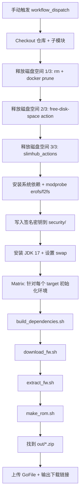
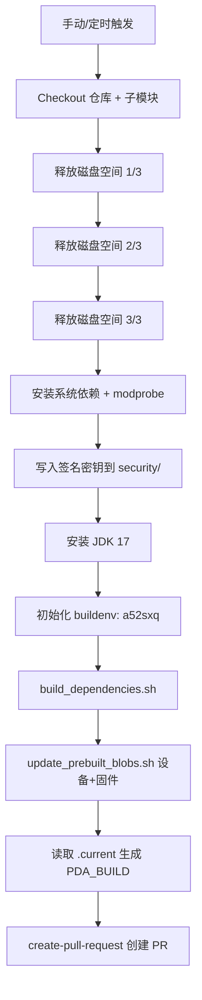

# UN1CA CI 工作流说明（Build & Blobs）

> 本文聚焦 `.github/workflows/build.yml` 与 `.github/workflows/blobs.yml` 的流程、脚本、输入/输出与产物说明，并附 Mermaid 架构流程图。

## Build 工作流（`build.yml`）

### 作用概览
- **用途**：构建 UN1CA 固件（ROM），包含依赖构建、固件下载/解包、ROM 打包与上传。
- **触发方式**：`workflow_dispatch`（手动触发）。
- **并行矩阵**：`target: [dm1q, dm2q, dm3q]`，每个 target 各跑一次。

### 关键输入
- **矩阵变量**：`matrix.target`（例如 `dm1q`）。
- **Secrets**：
  - `PLATFORM_KEY_PK8` / `PLATFORM_KEY_PEM`：签名用密钥，写入 `security/unica_platform.*`。
  - `GOFILE_TOKEN` / `GOFILE_FOLDER_ID`：上传产物到 GoFile。

### 编译/处理脚本与操作
- `buildenv.sh`（环境初始化）：`source ./buildenv.sh ${{ matrix.target }}`
- `./scripts/build_dependencies.sh`：构建依赖工具链与外部工具
- `./scripts/download_fw.sh`：下载官方固件
- `./scripts/extract_fw.sh`：解包固件
- `./scripts/make_rom.sh`：构建/打包 ROM

### 输出产物
- **本地产物**：`out/*.zip`（flashable ROM）
- **外部产物**：通过 GoFile 上传，返回下载链接

### Mermaid 流程图

---

## Blobs 工作流（`blobs.yml`）

### 作用概览
- **用途**：为多个设备自动更新 `prebuilts/samsung/<device>` 中的厂商 blobs，并自动创建 PR。
- **触发方式**：
  - `workflow_dispatch`（手动）
  - `schedule`（每日 UTC 12:00）
- **并行矩阵**：`matrix.include` 列表，包含多台设备与固件版本。

### 关键输入
- **矩阵变量**：`matrix.device`、`matrix.firmware`。
- **Secrets**：`PLATFORM_KEY_PK8` / `PLATFORM_KEY_PEM`（用于工具/签名环境初始化）。

### 编译/处理脚本与操作
- `buildenv.sh`（环境初始化）：当前固定为 `source ./buildenv.sh a52sxq`
- `./scripts/build_dependencies.sh`：构建依赖工具链
- `./scripts/internal/update_prebuilt_blobs.sh <device> <firmware>`：更新预编译 blobs
- 读取 `prebuilts/samsung/<device>/.current` 生成 `PDA_BUILD`
- 使用 `peter-evans/create-pull-request@v8` 创建 PR

> 说明：尽管矩阵包含多个 device，但 `buildenv.sh` 使用固定 target（`a52sxq`）。这通常表示“仅为初始化环境”，而非针对每台设备完整构建；如果脚本依赖 target-specific 变量，则可考虑将其改为每设备独立 target。

### 输出产物
- **仓库内产物**：更新后的 `prebuilts/samsung/<device>`
- **外部产物**：自动 PR（分支 `prebuilts/samsung/<device>`）

### Mermaid 流程图

---

## 流程差异总结
- **Build**：真正执行 ROM 构建（下载、解包、打包、上传）。
- **Blobs**：仅更新厂商预编译 blobs 并创建 PR，不产出 ROM 包。

## 可维护性建议（可选）
- 如 `buildenv.sh` 依赖 target-specific 变量，建议在 `blobs.yml` 中将 `a52sxq` 改为 `matrix` 中的显式字段（如 `build_target`），避免混淆。
- 在 PR 前添加校验步骤（例如检查 `prebuilts/samsung/<device>` 是否有实际变更）。

