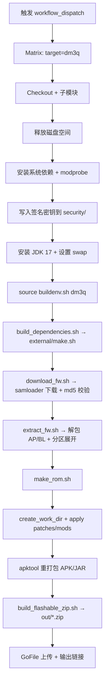

# dm3q 固件编译流程说明（CI 视角）

> 本文以 `build.yml` 中 `matrix.target=dm3q` 的执行路径为例，说明 dm3q 的固件编译流程、脚本职责、关键操作与产物，并提供 Mermaid 流程图。

## 1. 入口与环境初始化

### 触发方式
- GitHub Actions 手动触发 `workflow_dispatch`。
- `matrix.target` 包含 `dm3q`，因此会有一个 job 专门执行 dm3q 的构建。

### `buildenv.sh`（针对 dm3q 的环境）
`source ./buildenv.sh dm3q` 主要做：
- 定位仓库根目录并设置 `SRC_DIR`、`OUT_DIR`、`FW_DIR`、`TOOLS_DIR` 等路径。
- 将 `TOOLS_DIR/bin` 加入 `PATH`。
- 读取 `target/dm3q` 目录并生成 `out/config.sh`（由 `scripts/internal/gen_config_file.sh` 生成）。
- 导出与 dm3q 相关的构建变量（例如 `TARGET_CODENAME`、`TARGET_PLATFORM`、`SOURCE_FIRMWARE`、`TARGET_FIRMWARE` 等）。

## 2. 构建依赖（`scripts/build_dependencies.sh`）
该脚本仅调用 `external/make.sh`，实际构建/准备一系列工具：
- **android-tools**（`adb`、`fastboot`、`lpunpack`、`mkdtboimg` 等）
- **apktool**（用于反编译/重打包 APK/JAR）
- **erofs-utils**（`mkfs.erofs`、`fuse.erofs` 等）
- **img2sdat**（镜像差分/转换工具）
- **samloader**（固件下载工具，安装在 venv 中）
- **signapk**（签名工具）

这些工具最终会被复制到 `out/tools/bin` 供后续流程使用。

## 3. 下载固件（`scripts/download_fw.sh`）
对 dm3q 所配置的固件源执行：
- 解析 `SOURCE_FIRMWARE` / `TARGET_FIRMWARE`（基于 `out/config.sh`）。
- 使用 `samloader` 拉取最新固件包。
- 解压 ZIP 并校验 `.md5` 签名。
- 写入 `out/odin/<MODEL>_<CSC>/.downloaded` 标记。

## 4. 解包固件（`scripts/extract_fw.sh`）
对已下载固件执行：
- 从 Odin 包中抽取 `BL/AP`。
- **AVB**：提取 `vbmeta.img` 并生成 `vbmeta_patched.img`。
- **Kernel**：提取 `boot.img`、`dtbo.img`、`vendor_boot.img` 等到 `out/fw/<MODEL>_<CSC>/kernel/`。
- **OS 分区**：解析 `super.img` 或单独分区（system/vendor/product/odm 等），执行 `unsparse` + `mount` 复制，生成 `fs_config` 与 `file_context`。

这一步会构建后续 ROM 打包所需的完整分区文件树。

## 5. 生成 ROM（`scripts/make_rom.sh`）
核心流程如下：
1. 判断是否需要重建（通过 work dir hash）。
2. 必要时再次确保固件已下载/解包。
3. `scripts/internal/create_work_dir.sh`：生成工作目录（组合各分区文件）。
4. `scripts/internal/apply_modules.sh`：
   - 平台补丁：`platform/<TARGET_PLATFORM>/patches`
   - 设备补丁：`target/dm3q/patches`
   - ROM 补丁：`unica/patches`
5. `unica/mods`：执行 ROM mods。
6. `scripts/apktool.sh`：对 APK/JAR 进行重打包（并行执行）。
7. `scripts/internal/build_flashable_zip.sh`：生成最终刷机包 ZIP。

## 6. CI 输出产物
- **本地产物**：`out/*.zip`（最终刷机包）。
- **CI 上传**：`build.yml` 最后会将 zip 上传到 GoFile，并输出下载链接。

## 7. Mermaid 架构流程图（dm3q）

## 8. 输出文件位置（dm3q）
- `out/target/dm3q/`：dm3q 专属工作目录
- `out/fw/<MODEL>_<CSC>/`：解包后的固件分区文件
- `out/*.zip`：最终刷机包

---

## 备注
- 本文基于当前 `build.yml` 与相关脚本实现，若脚本参数或路径变化，请以最新脚本为准。
